# conception UML

Le Langage de Modélisation Unifié, de l'anglais Unified Modeling Language (UML), est un langage de modélisation graphique à base de pictogrammes conçu comme une méthode normalisée de visualisation dans les domaines du développement logiciel et en conception orientée objet.

### Avantages de la modélisation normalisée :

Lorsque nous parlons de normes, nous parlons de règles.

Le respect et la connaissance de ces règles, fait que tout le monde parle d'une même voix, et donc tout le monde se comprend.

Sachant que le résultat d'une modélisation est un ensemble de dossiers que nous fournirons au client, aux programmeurs, aux testeurs, aux intégrateurs etc.., il est nécessaire d'utiliser une méthodologie normalisée (comme Merise), et un mode de représentation normalisé de cette méthodologie, c'est ici qu'intervient UML.

## Diagrammes de cas d'utilisation

### Analyse des besoins

Point de départ du précessus de développement, ce diagramme se situe dans l'analyse des besoins.

A quoi et et à qui va servir le système que nous allons développer ?

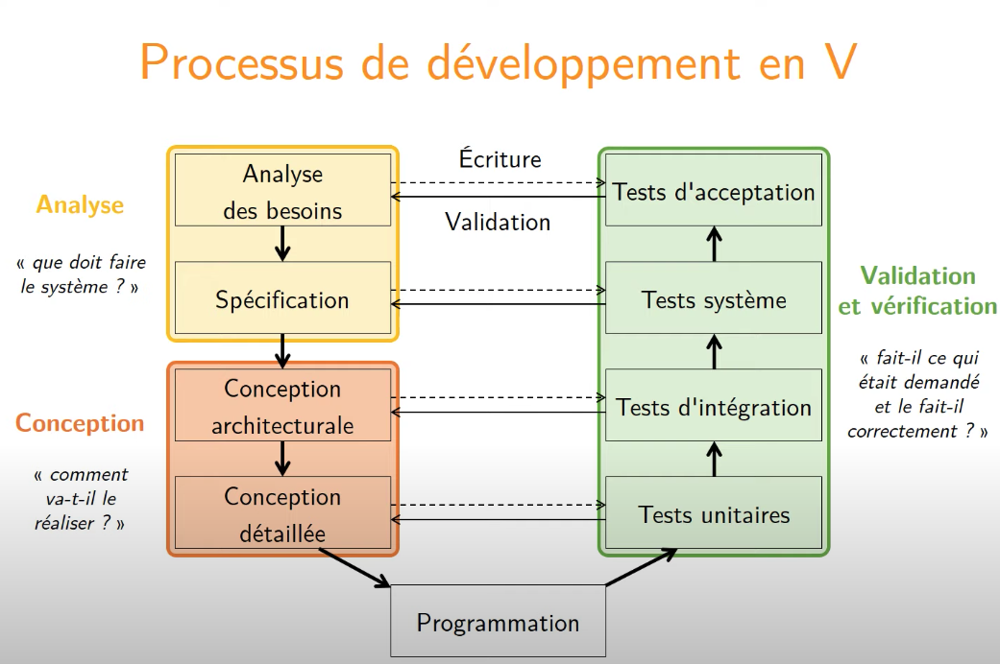

Le but de cette analyse c'est de comprendre les besoins du client pour rédiger le cahier des charges fonctionnel.

Trois questions :

- Définir les utilisateurs principales du système : à quoi sert-il ?
- Définir l'environnement du système : qui va l'utiliser ou interagir avec lui ?
- Définir les limites du système : où s'arrête sa responsabilité ?

### Scénario d'utilisation

Suite d'interactions entre un ou plusieurs utilisateurs et le système qui va permettre à l'utilisateur d'effectuer une tâche complexe :

- décrire une interaction entre l'utilisateur et le système
- permettant de de réaliser un objectif

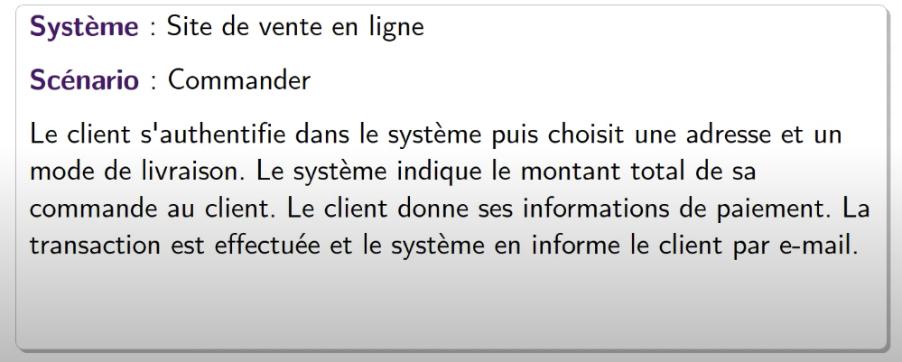

Définir les fonctionnalités principales du système du point de vue extérieur :

- Acteur : entité qui interagit avec le système
	- Personne, chose, logiciel, extérieur au système décrit
	- Représenté par un rôle (plusieurs rôles possibles pour une même entité)
	- Identifié par le nom du rôle
	
- Action : fonctionnalité visible de l'extérieur
	- Action déclenchée par un acteur
	- Identifié par une action (verbe à l'infinitif)

### Diagramme (de cas d'utilisation)

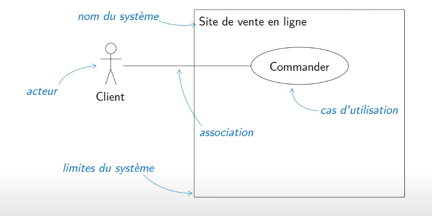

Attention au vocabulaire, car il sera utilisé pendant toute la conception.
Un glossaire peut être fourni.

### Exemple

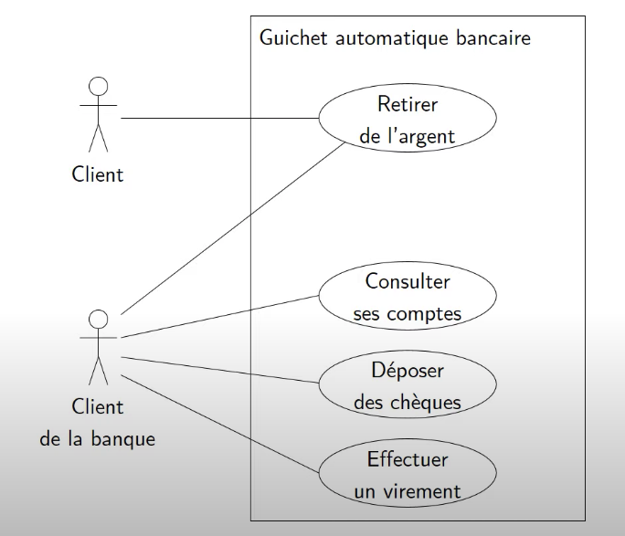

#### avec héritage 

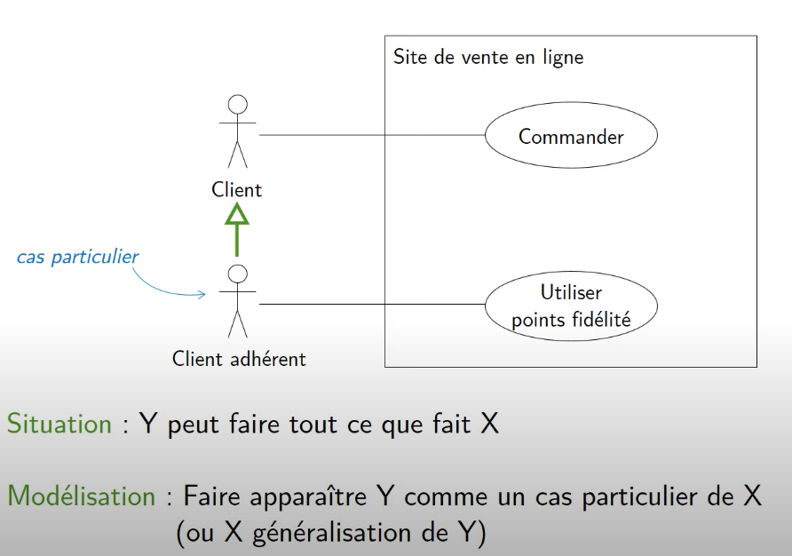

#### relation entre cas d'utilisation

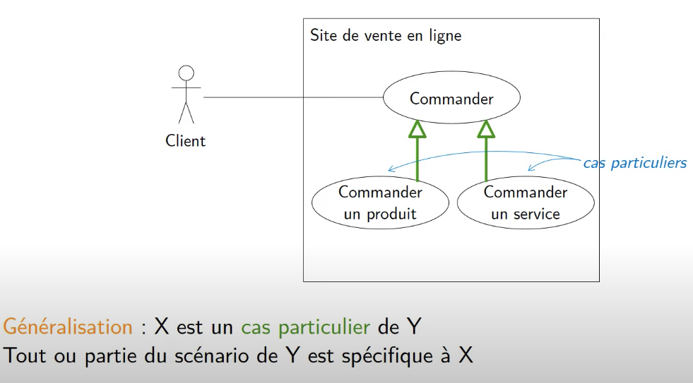

## Diagrammes d'activité

Les diagrammes d'activités permettent de déterminer des traitements a priori séquentiels. Ils offrent un pouvoir d'expression très proche des langages de programmation objet: spécification des actions de base (déclaration de variables, affectation etc.), structures de contrôle (conditionnelles, boucles), ainsi que les instructions particulières à la programmation orientée objet (appels d'opérations, exceptions etc.).

 Ils sont donc bien adaptés à la spécification détaillée des traitements en phase de réalisation. On peut également utiliser de façon plus informelle pour décrire des enchaînements d'actions de haut niveau, en particulier pour la description détaillée en cas d'utilisation.

Les diagrammes d'activités présentent plusieurs avantages pour les utilisateurs :

*	Démontrer la logique d'un algorithme

*	Décrire les étapes effectuées dans un cas d'utilisation d'UML

*	Illustrer un processus métier ou un flux de travail entre les utilisateurs et le système

*	Simplifier et améliorer n'importe quel processus en clarifiant les cas d'utilisation complexes

*	Modéliser des éléments de l'architecture de logiciels, tels que la méthode, la fonction et l'utilisation

**Composants de base d’un diagramme d'activités :**

*	**Action :** étape dans l'activité où les utilisateurs ou le logiciel exécutent une tâche donnée. Les actions sont symbolisées par des rectangles aux bords arrondis.

*	**Nœud de décision :** embranchement conditionnel dans le flux, qui est représenté par un losange. Il comporte une seule entrée et au moins deux sorties.

*	**Nœud de départ :** élément symbolisant le début de l'activité, que l'on représente par un cercle noir.

*	**Nœud de fin :** élément symbolisant l'étape finale de l'activité, que l'on représente par un cercle noir avec un contour.

### Action

Une action est le plus petit traitement qui puisse être exprimé en UML. Une action a une incidence sur l'état du système ou en extrait une information. Ce sont des étapes discrètes à partir desquelles se construisent les comportements. La notion d'action est à rapprocher de la notion d'instruction élémentaire d'un langage de programmation. Par exemple, une action peut être: 

* la création d'un nouvel objet ou lien 
* l'émission d'un signal 
* une affectation de valeur à des attributs 
* la réception d'un signal 
* un calcul arithmétique simple etc.

#### Les différents types d'actions

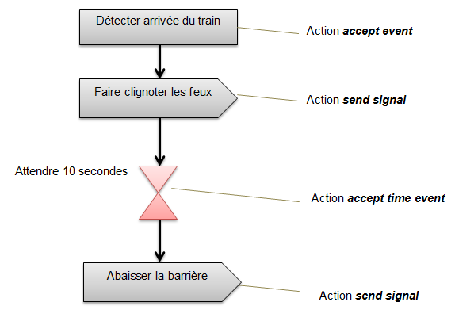

Premièrement, on détecte l'arrivée du train; cette action représente l'action "accept event" c'est-à-dire qu'on reçoit le signal de l'arrivée du train. Deuxièmement, "faire clignoter les feux" est une action "send signal", cela veut dire qu'on envoie un signal qui est transmis à un objet cible sans attendre que ce dernier ait bien reçu le signal. 

Ensuite, l'action "time event" est un événement temporel déclenché après l'écoulement d'une certaine durée. Enfin, "abaisser la barrière" est une action "send signal", un message est envoyé et transmis à la cible.

On distingue graphiquement les actions associés à une communication: send signal, accept event et accept time event. Cela permet de mieux mettre en valeur les échanges entre les diagrammes de la spécification.

### Activité

Une activité définit un comportement décrit par une série organisée d'unités dont les éléments simples sont les actions. Le flot d'exécution est modélisé par des nœuds reliés par des arcs (transitions). Le flot de contrôle reste dans l'activité jusqu'à ce que le traitement soit terminé. 

Une activité est un comportement et peut comporter des paramètres en entrée ou en sortie, ainsi que des variables locales au même titre qu'une opération.

Une activité peut regrouper des nœuds et des arcs, c’est ce qu'on peut appeler "groupe d'activités". Les nœuds et les arcs peuvent appartenir à plusieurs groupes. Le groupe d'activités représente un système qui est générique regroupant des activités pouvant être utilisé de façon variée. 

Un diagramme d'activité est lui-même un groupe d'activités. Voici ci-dessous un exemple de diagramme d'activités qui représente le fonctionnement d'une borne bancaire:

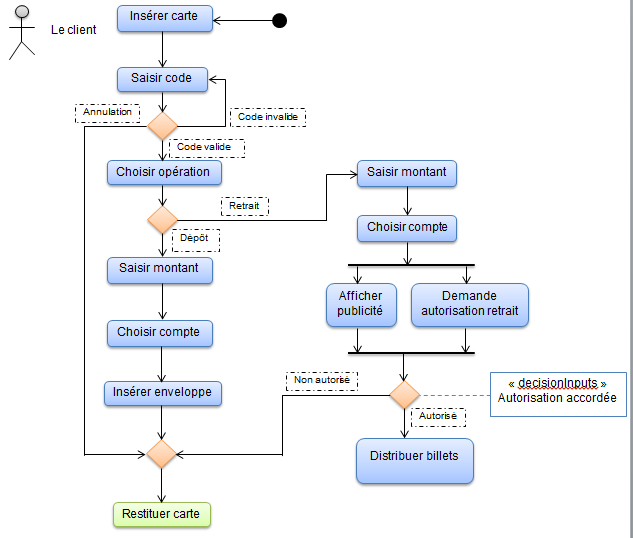

Cet exemple illustre différentes représentations des actions. Après avoir saisi le code, deux activités sont déclenchées: on choisit l'opération souhaitée si le code est valide ou la carte est restituée si on annule l'opération. Après avoir choisi l'opération, on trouve deux alternatives: choisir un montant qu'on dépose (dépôt) ou retire (retrait). 

Dans les deux cas, nous choisissons le compte par la suite. Si nous avons choisi de déposer des billets, nous devons insérer une enveloppe ce qui nous donne droit à la restitution de notre carte à la fin de l'opération. 

Si nous avons pris le choix d'effectuer un retrait de billets, nous avons le droit à deux options: afficher une publicité ou demander une autorisation de retrait. Enfin, la note portant le mot-clé "decisionInput" spécifie un critère de décision parmi plusieurs arcs d'activité, dont chacun doit satisfaire la variable "autorisation accordée" à "Non autorisé" ou "Autorisé" avant que la transition associée ne puisse être déclenchée 

### Nœuds

Après avoir expliqué le diagramme d'activités et son fonctionnement, nous abordons majoritairement des nœuds qui sont essentiels dans un diagramme d'activités. Elle permet d'évoquer davantage en détail le contenu d'un diagramme d'activités.

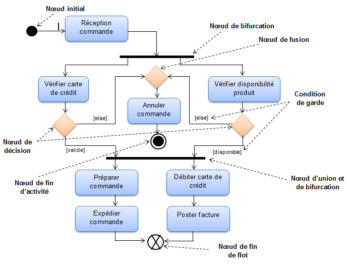

### Partitions

Les partitions sont aussi des éléments essentiels dans un diagramme d'activités. En effet, elles sont appelées couloirs ou lignes d'eau. Elles ont pour but d'organiser les noeuds d'activités disposés dans un diagramme d'activités par le biais de regroupements. Ce sont des unités d'organisation du modèle. 

Ces partitions sont utiles lorsqu'on doit désigner la classe responsable qui rassemble un ensemble de tâches par exemple. La classe en question est donc responsable du comportement des noeuds à l'intérieur de la partition précédemment évoquée. 

Graphiquement, les partitions sont représentées par des lignes continues. Elles peuvent prendre la forme d'un tableau. De plus, les noeuds d'activités doivent appartenir à une seule et unique partition et les transitions peuvent passer à travers les frontières des partitions.

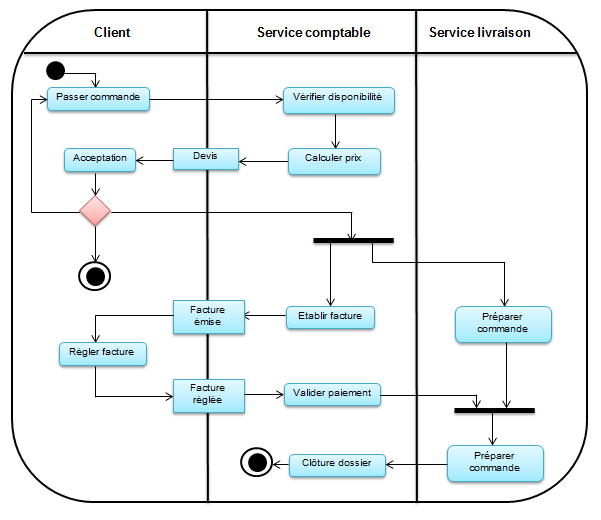

## Diagrammes des classes

Conception orientée objet : Représentation du système comme un ensemble d'objets interagissant.

il s'agit d'une représentation de la structure interne du logiciel.

### Rappel sur la définition d'un objet

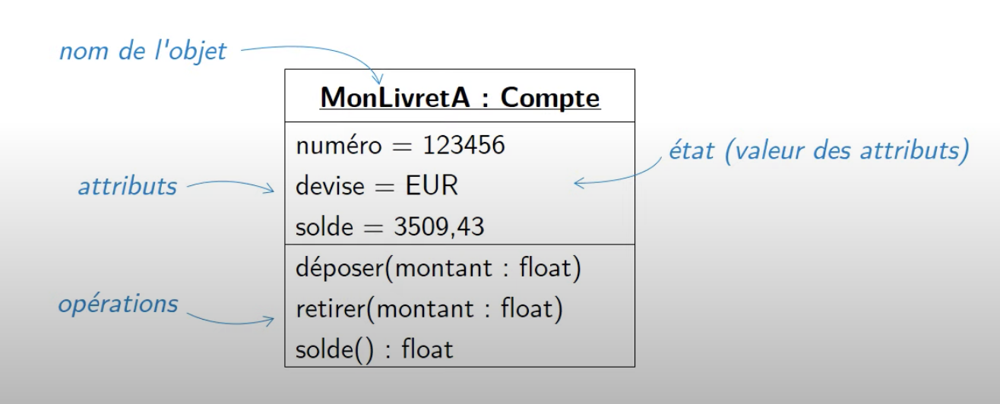

### Rappel sur la définition d'une classe

Regroupement d'objets de même nature (mêmes attributs + mêmes opérations)

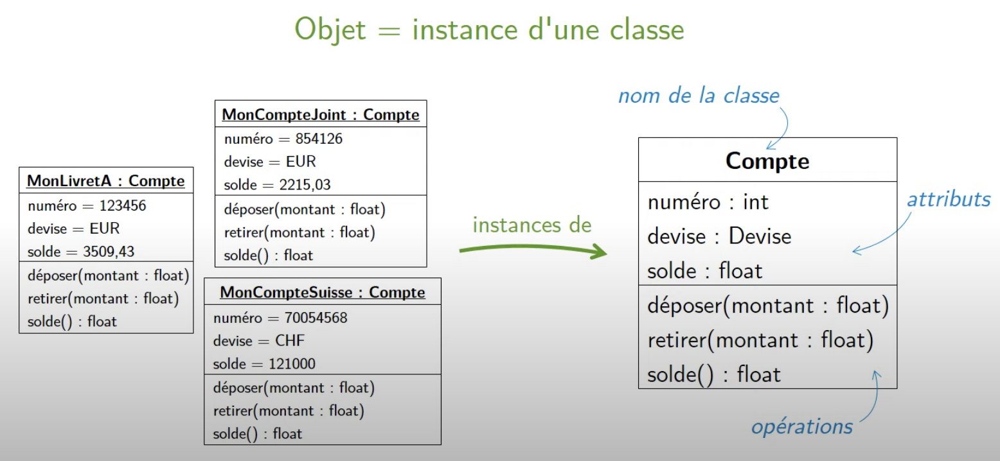

### Relations entre classes

Rôle : Nomme l'extrémité d'une association, permet d'accéder aux objets liés par l'association à un objet donné.

Multiplicité : Contraint le nombre d'objets liés par l'association

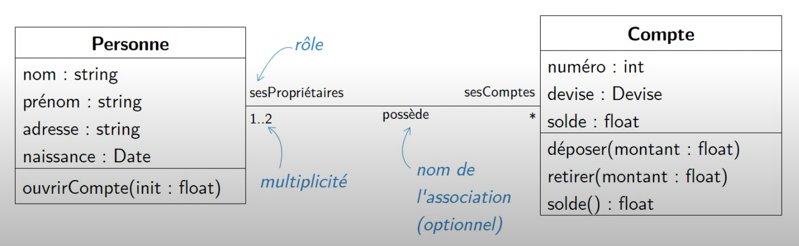

### Remarque

Pas d'attribut dont le type est une classe du diagramme

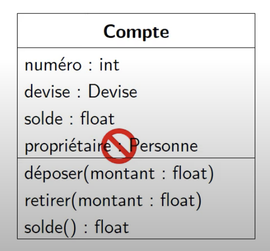

### Multiplicités en pratique

Nombre d'objets de la classe B associés à un objet de la classe A

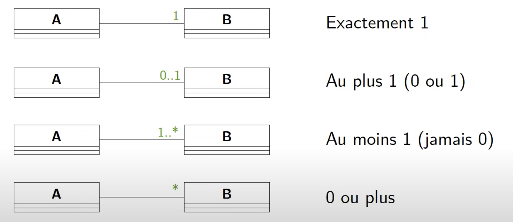

### Exemple de diagramme

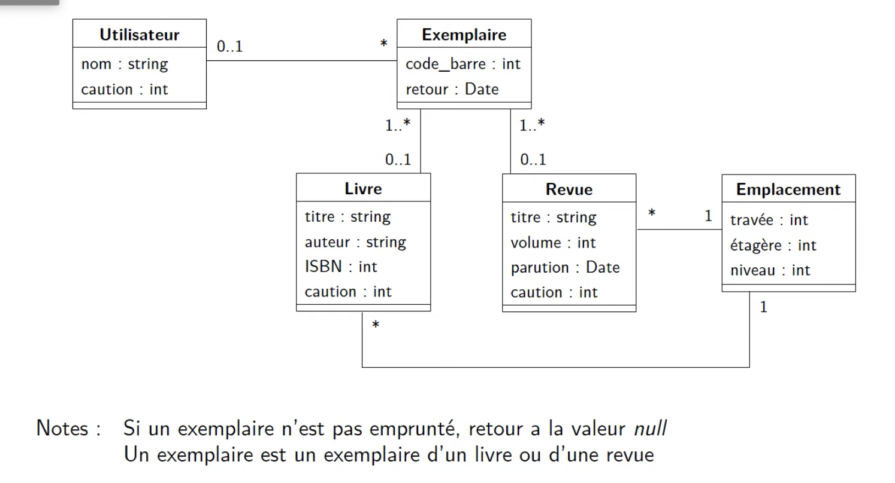

